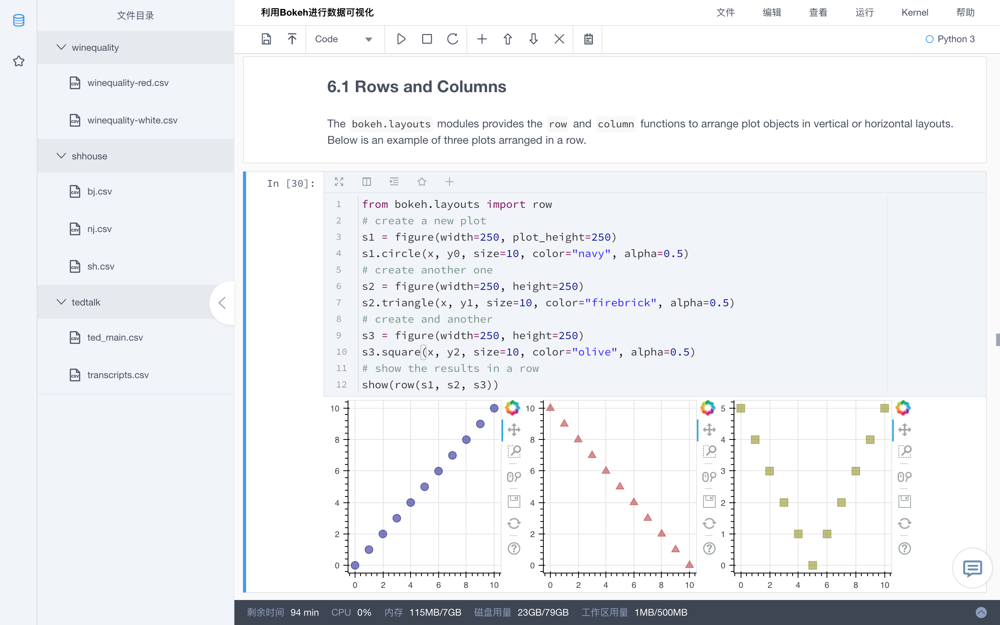

# Org_Admin
# K-Lab组织版 --- 管理员手册

欢迎使用K-Lab，在这个数据科学与人工智能社区内，你将会体验到全新的在线数据分析协作平台。

K-Lab是一款在线数据分析协作工具，通过在云端为用户管理所有底层基础架构，让数据工作者能够避免数据工程问题的困扰，快速连接数据、算力与模型，专注在数据价值的创造。有了K-Lab，用户能随时随地在浏览器中方便、快捷地进行数据处理、模型搭建、参数调优、数据可视化以及撰写报告等分析工作。

K-Lab针对组织内部的数据分析协作场景提供了K-Lab组织版产品形态，解决多用户场景下的管理难题与协作难题。

 

在K-Lab组织版内，我们为你提供：

* 在浏览器内可交互的[Notebook(编程环境)](ch1/chapter1.md)
* 强健稳定的[Kernel(计算环境)](ch2/chapter2.md)
* 个人独享的[磁盘空间](ch3/chapter3.md)
* 丰富便捷的[数据集](ch4/chapter4.md)
* 针对多成员协作的[组织管理](ch7/chapter.md)
