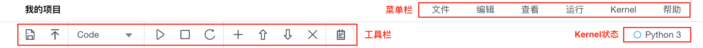

# Header
Header包含了菜单栏、工具栏与kernel状态。用户在编辑Notebook时Header会一直保持在页面顶端。
 

**菜单栏**
* **文件**：对整体项目文件的操作
* **编辑**：对cell单元的操作
* **查看**：对不同视图模块的显示操作
* **运行**：不同形式的cell运行命令
* **Kernel**：对kernel的操作指令
* **帮助**：K-Lab相关的使用帮助

**工具栏**
工具栏中提供了数据分析过程的常用操作按钮。

**Kernel状态**
在工具栏右侧会显示当前的kernel类型与kernel状态，当圆圈为空心时代表kernel空闲，当圆圈为实心时代表kernel忙碌。
