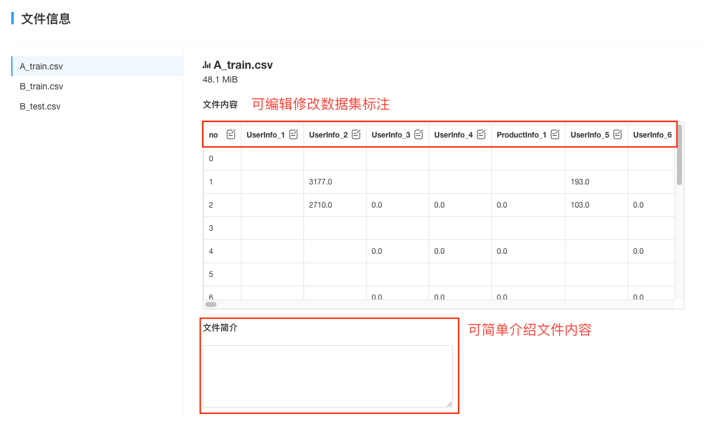
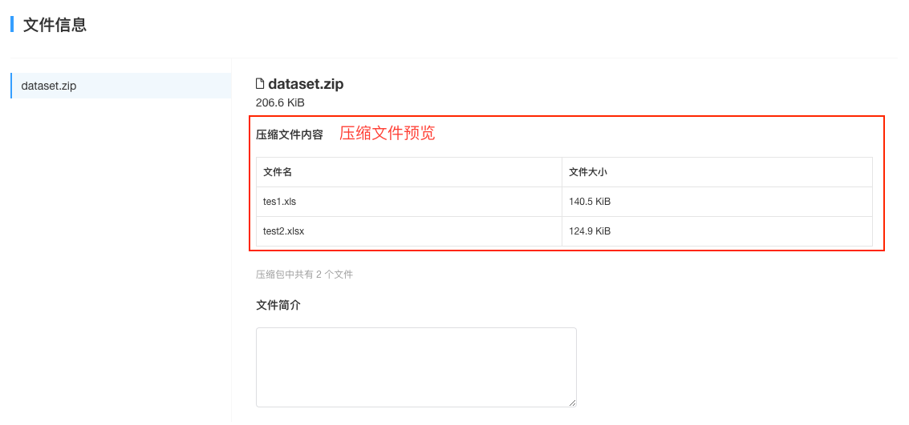

# 创建数据集

在**数据集**中可点击蓝色 `+` 进行数据集的创建。

该功能分为两个步骤，数据集制作与数据集信息完善。
### 数据集制作
**填写数据集名称**：用户对将要创建的数据集进行命名

**设置挂载目录**：挂载目录为可以在K-Lab Notebook中访问到数据集的地址，挂载目录的设置支持字母、数字及下划线，**在创建后不可修改**。以上传名为package.xlsx的数据文件为例，若设置挂载目录为 `first_dataset`，则挂载了该数据集的项目运行K-lab时可以在 `/home/kesci/input/first_dataset/`目录下访问到该数据集。

**数据集权限**：组织管理员创建数据集时可以为数据集设置访问权限。详情参见[数据集权限](chapter4.md##数据集权限)

**添加文件**：K-Lab支持用户在一个数据集目录下面上传不超过20个文件，文件总大小不超过100M，上传文件格式不限。推荐用户上传csv格式文件，K-lab支持csv格式文件内容的预览。若文件数目较多，建议压缩成zip文档后上传，K-Lab将自动解压一级目录下的zip文件。

点击创建即可完成数据集的制作。

### 数据集信息完善
建议创建者能够完善数据集文档与数据文件的标注，方便在基于数据集的协作时他人能够理解该数据的背景信息。
* **数据集信息**：进行数据集封面图片，数据集名称，短描述的编辑。

* **数据集文档和文件信息**:数据集文档是对数据集背景信息及包含内容的概述。在文件信息页面，用户可以预览csv文件的前20行数据，并且修改数据集标注。对于zip格式的文件，用户可以预览压缩包内的文件数量，名称及大小。用户可以对每个文件编写简介。

