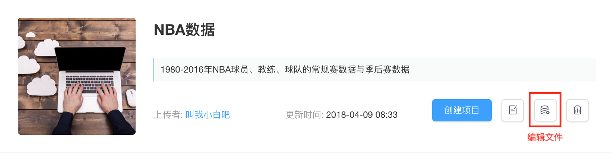

# 管理数据集

用户可以在`数据集页面`，访问当前已经创建好的数据集，并可以在数据集下直接选择**创建项目**，或完成对**数据集信息**和**数据集文件**的修改，以及**删除当前数据集**等操作。
* **创建项目**：创建一个挂载该数据集的K-Lab项目。

* **编辑属性**：修改数据集信息。用户可以修改数据访问权限，对数据集的名称、短描述进行修改，编写数据集文档，并对csv类型的数据集文件做标注。
 

* **编辑文件**：用户可以该数据集下的文件做修改，如上传新文件、删除旧文件。
 

* **删除数据集**：删除该数据集。用户个人上传的数据集一经删除，无法找回。
