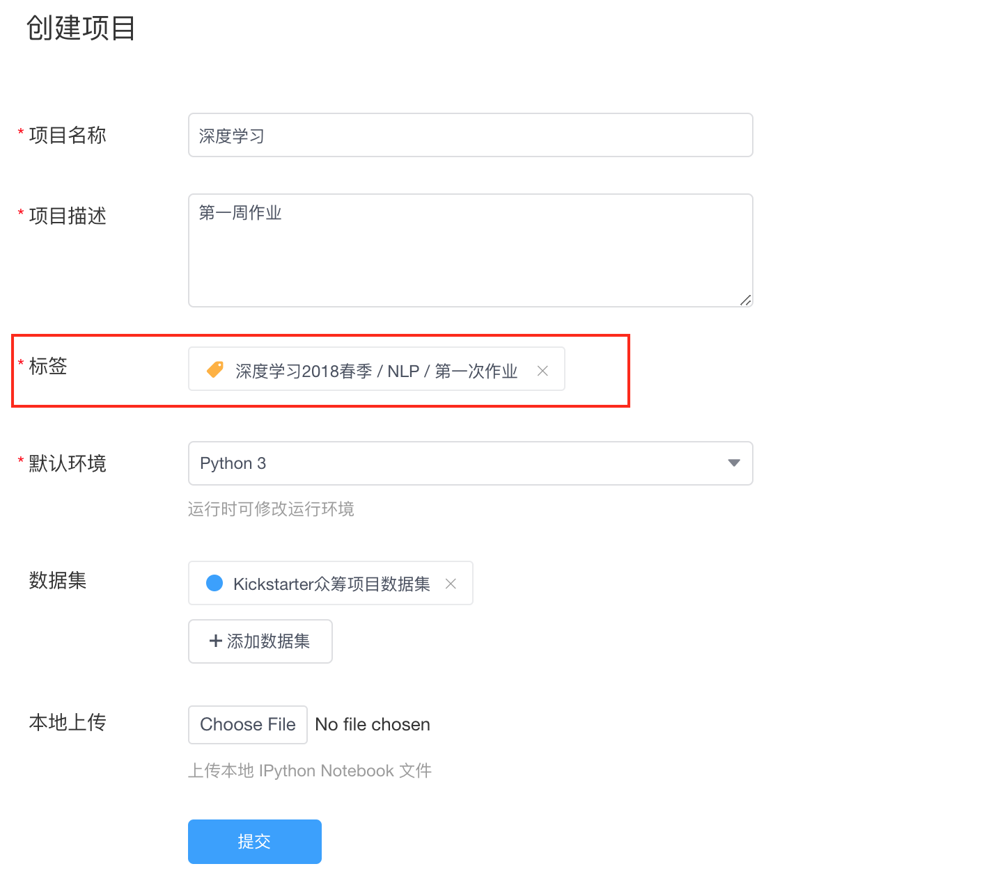
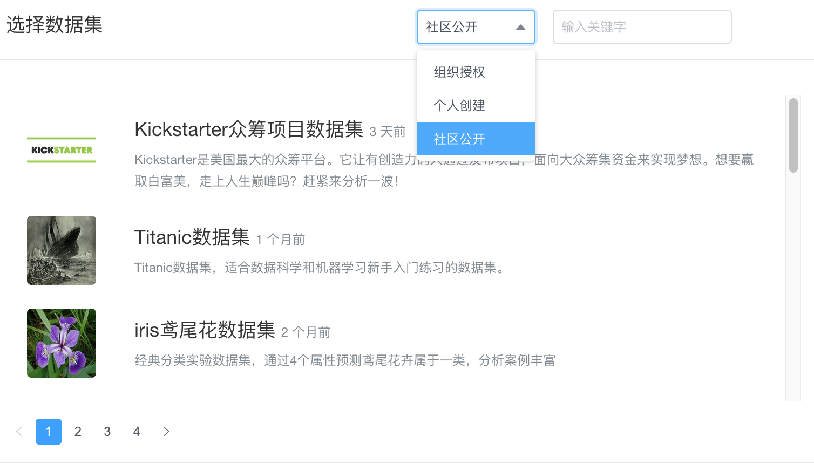

# 创建项目

在`项目`中可点击蓝色 `+` 进行项目的创建。

* **填写项目名称**：用户对将要创建项目的命名。
* **填写项目描述**：用户对将要创建项目的描述，不超过140字符。
* **添加标签**：用户可以在创建项目时给项目添加标签，将项目归类，便于提交项目后管理员对项目进行筛选及审阅。一个项目只能添加一个标签。详情参见[标签管理]()。
  

* **设置项目环境**：用户创建的项目可以选择初始运行环境，K-Lab支持**Python 2 & 3** 和 **R** 这三种运行环境。用户也可在项目运行时在kernel菜单栏切换环境。
* **添加项目数据集**：用户可以在创建项目时挂载将要使用的数据集。在创建项目之后，如果需要修改数据集，可以在该项目详情页`修改项目属性`进行数据集的添加。
在K-Lab组织版里，用户创建项目时可以选择挂载三种不同的数据集：**组织授权数据集**，**个人创建的私有数据**和**社区公开的数据集资源**。一个项目最多挂载**三个**数据集。挂载的数据集可以在修改项目中进行修改。运行项目时，项目挂载的数据集可以在`/home/kesci/input/`下找到。
  
* 上传本地IPython Notebook文件：K-Lab支持原生```.ipynb```文件，用户可以直接上传本地的Notebook文件导入K-Lab完成后续编写运行。