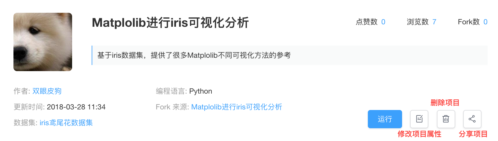

# 管理项目

用户可以在`项目`中查看和管理个人创建的项目，并完成**运行项目**，**修改项目属性**，**删除项目**，**分享项目**等操作。
 
* **修改项目属性**：用户可以通过该入口修改项目名称、修改项目描述、**修改项目标签**、**修改挂载数据集**。

* **删除项目**：项目一经删除，无法找回。
* **分享项目**：用户可以通过访问链接的方式将项目分享给他人，被分享者可以在浏览器中直接浏览作者的数据分析成果。通过可以通过`Fork`功能运行该项目。项目需要发布至少一个版本后才能被分享。