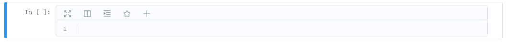

# 命令模式

当前cell显示灰色边框，并且左边有蓝条标识。

* `X`：剪切选中cell
* `Shift`+`J`    
  `Shift`+`ArrowDown`：向下选择cell
* `Shift`+`K`
  `Shift`+`ArrowUp`：向上选择cell
* `Z`：撤销操作
* `ArrowDown`：选择下方cell
* `ArrowUp`：选择上方cell
* `A`：在上方插入cell
* `B`：在下方插入cell
* `Ctrl`+`ArrowUp`：向上移动
* `Ctrl`+`ArrowDown`：向下移动
* `D`,`D`：删除选中cell
* `Ctrl`+`M`：编辑cell的metadata
* `C`：复制选中cell
* `V`：粘贴在当前cell下方
* `Shift`+`V`：粘贴在当前cell上方
* `O`：显示/不显示输出
* `Shift`+`O`：显示/不显示滚动条
* `Shift`+`M`：合并选中cell
* `Shift`+`Enter`：运行并选中下方cell
* `M`：切换cell类型为markdown
* `Y`：切换cell类型为code
* `Enter`：进入编辑模式
* `Esc`：清除选择的cell
* `H`：打开快捷键帮助
* `0`,`0`：重启kernel
